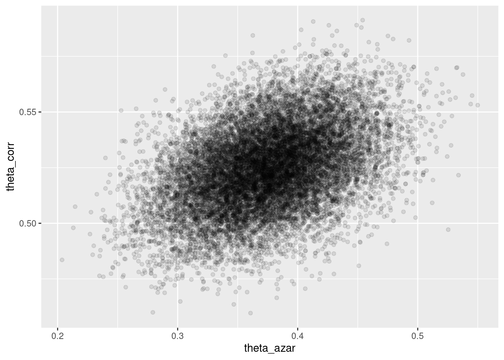
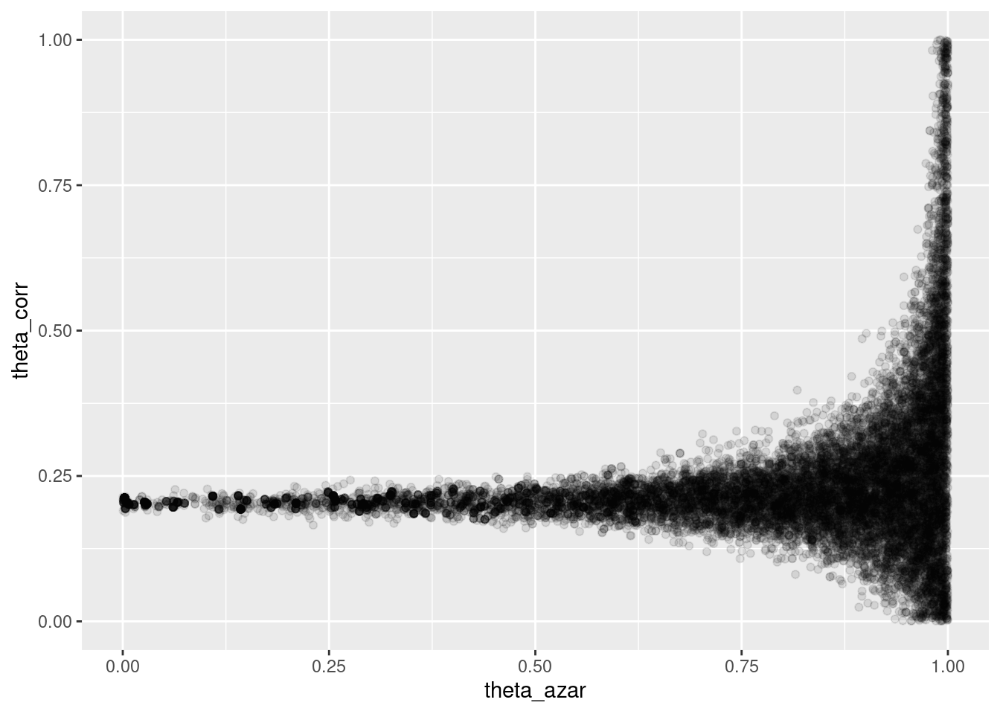
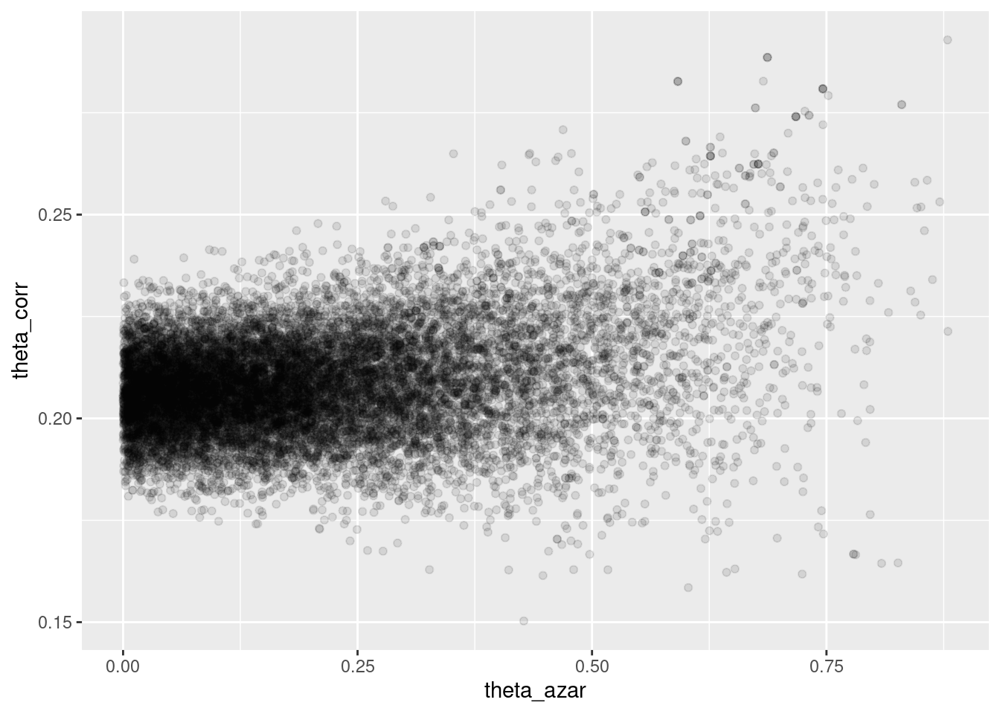

# Ejemplos de inferencia bayesiana en Stan I


En esta parte veremos cómo correr y diagnosticar en Stan varios ejemplos vistos en clase. Para instalar *cmdstanr* y Stan, puedes ver [aquí](https://mc-stan.org/cmdstanr/). En python puedes usar *pystan*, por ejemplo.


```r
# install.packages("cmdstanr", repos = c("https://mc-stan.org/r-packages/", getOption("repos")))
library(cmdstanr)
library(posterior)
library(tidyverse)
```


## Estimación de una proporción {-}

Escribimos el código para el modelo en un archivo *modelo-1.stan*, 
y compilamos:


```r
mod
```

```
## // Ejemplo de estimación de una proporcion
## data {
##   int n; // número de pruebas
##   int y; //numero de éxitos y fracasos
## }
## 
## parameters {
##   real<lower=0,upper=1> theta;
## }
## 
## model {
##   // inicial
##   theta ~ beta(3, 3);
##   y ~ binomial(n, theta);
## }
## 
## generated quantities {
##   real theta_inicial;
##   theta_inicial = beta_rng(3, 3);
## }
```

Pasamos datos y muestreamos


```r
datos_lista <- list(n = 30, y = 19)
ajuste <- mod$sample(
  data = datos_lista,
  seed = 1234,
  chains = 4,
  parallel_chains = 4,
  refresh = 500)
```

```
## Running MCMC with 4 parallel chains...
```

```
## Chain 1 ./modelo-1: 1: d9__stubs__TEXTX__init_offsets__TEXT88__gcc_except_tab__TEXT__const__TEXTKrK__cstring__TEXTZ__unwind_info__TEXT$
$
__eh_frame__TEXT(?
(?
__DATA_CONST@
@
__got__DATA_CONST@
@
__const__DATA_CONSTP
pWP
8__DATA
@
@__data__DATA

__common__DATA
__bss__DATA
8H__LINKEDIT@4[3[7؜plP: File name too long
```

```
## Chain 1 ./modelo-1: 1: X!H__PAGEZERO__TEXT@
@
__text__TEXTd9: not found
```

```
## Chain 1 ./modelo-1: 2: 
: not found
```

```
## Chain 1 ./modelo-1: 3: Syntax error: "(" unexpected
```

```
## Chain 2 ./modelo-1: 1: d9__stubs__TEXTX__init_offsets__TEXT88__gcc_except_tab__TEXT__const__TEXTKrK__cstring__TEXTZ__unwind_info__TEXT$
$
__eh_frame__TEXT(?
(?
__DATA_CONST@
@
__got__DATA_CONST@
@
__const__DATA_CONSTP
pWP
8__DATA
@
@__data__DATA

__common__DATA
__bss__DATA
8H__LINKEDIT@4[3[7؜plP: File name too long
```

```
## Chain 2 ./modelo-1: 1: X!H__PAGEZERO__TEXT@
@
__text__TEXTd9: not found
```

```
## Chain 2 ./modelo-1: 2: 
: not found
```

```
## Chain 2 ./modelo-1: 3: Syntax error: "(" unexpected
```

```
## Chain 3 ./modelo-1: 1: d9__stubs__TEXTX__init_offsets__TEXT88__gcc_except_tab__TEXT__const__TEXTKrK__cstring__TEXTZ__unwind_info__TEXT$
$
__eh_frame__TEXT(?
(?
__DATA_CONST@
@
__got__DATA_CONST@
@
__const__DATA_CONSTP
pWP
8__DATA
@
@__data__DATA

__common__DATA
__bss__DATA
8H__LINKEDIT@4[3[7؜plP: File name too long
```

```
## Chain 3 ./modelo-1: 1: X!H__PAGEZERO__TEXT@
@
__text__TEXTd9: not found
```

```
## Chain 3 ./modelo-1: 2: 
: not found
```

```
## Chain 3 ./modelo-1: 3: Syntax error: "(" unexpected
```

```
## Chain 4 ./modelo-1: 1: d9__stubs__TEXTX__init_offsets__TEXT88__gcc_except_tab__TEXT__const__TEXTKrK__cstring__TEXTZ__unwind_info__TEXT$
$
__eh_frame__TEXT(?
(?
__DATA_CONST@
@
__got__DATA_CONST@
@
__const__DATA_CONSTP
pWP
8__DATA
@
@__data__DATA

__common__DATA
__bss__DATA
8H__LINKEDIT@4[3[7؜plP: File name too long
```

```
## Chain 4 ./modelo-1: 1: X!H__PAGEZERO__TEXT@
@
__text__TEXTd9: not found
```

```
## Chain 4 ./modelo-1: 2: 
: not found
```

```
## Chain 4 ./modelo-1: 3: Syntax error: "(" unexpected
```

```
## Warning: Chain 1 finished unexpectedly!
```

```
## Warning: Chain 2 finished unexpectedly!
```

```
## Warning: Chain 3 finished unexpectedly!
```

```
## Warning: Chain 4 finished unexpectedly!
```

```
## Warning: All chains finished unexpectedly! Use the $output(chain_id) method for more information.
```

```
## Warning: Use read_cmdstan_csv() to read the results of the failed chains.
```

```
## Warning: No chains finished successfully. Unable to retrieve the fit.
```

Checamos diagnósticos:


```r
ajuste$cmdstan_diagnose()
```

```
## Error: No CmdStan runs finished successfully. Unable to run bin/diagnose.
```

Si no hay problemas, podemos ver el resumen:


```r
ajuste$summary()
```

```
## Error: No chains finished successfully. Unable to retrieve the draws.
```
Donde verificamos que el tamaño de muestra efectivo (ess) y el diagnóstico de
$\hat{R}$ son apropiados.

Podemos ver las cadenas de la siguiente forma:


```r
theta_tbl <- ajuste$draws(c("theta", "theta_inicial")) %>% as_draws_df()
```

```
## Error: No chains finished successfully. Unable to retrieve the draws.
```

```r
ggplot(theta_tbl, aes(x = .iteration, y = theta)) +
  geom_line() +
  facet_wrap(~.chain, ncol = 1)
```

```
## Error in ggplot(theta_tbl, aes(x = .iteration, y = theta)): object 'theta_tbl' not found
```

Y replicamos la gráfica de las notas haciendo:


```r
sims_tbl <- theta_tbl %>% pivot_longer(theta:theta_inicial, names_to = "dist", values_to = "theta")
```

```
## Error in pivot_longer(., theta:theta_inicial, names_to = "dist", values_to = "theta"): object 'theta_tbl' not found
```

```r
ggplot(sims_tbl, aes(x = theta, fill = dist)) + 
  geom_histogram(aes(x = theta), bins = 30, alpha = 0.5, position = "identity")
```

```
## Error in ggplot(sims_tbl, aes(x = theta, fill = dist)): object 'sims_tbl' not found
```

## Estimación del máximo de una uniforme {-}

Tomamos el ejemplo de los boletos de lotería


```r
loteria_tbl <- read_csv("data/nums_loteria_avion.csv", col_names = c("id", "numero")) %>% 
  mutate(numero = as.integer(numero))
```

```
## Rows: 99 Columns: 2
## ── Column specification ────────────────────────────────────────────────────────
## Delimiter: ","
## chr (1): numero
## dbl (1): id
## 
## ℹ Use `spec()` to retrieve the full column specification for this data.
## ℹ Specify the column types or set `show_col_types = FALSE` to quiet this message.
```

```r
set.seed(334)
muestra_loteria <- sample_n(loteria_tbl, 25) %>% 
  mutate(numero = numero/1000)
```


```r
mod
```

```
## // Ejemplo de estimación del máximo de uniforme
## data {
##   int n; // número de observaciones
##   real y[n]; //datos observados
## }
## 
## transformed data{
##   real y_max;
##   y_max = max(y);
## }
## parameters {
##   real<lower=y_max> theta;
## }
## 
## model {
##   // inicial
##   theta ~ pareto(300, 1.1);
##   y ~ uniform(0, theta);
## }
```

Pasamos datos y muestreamos


```r
datos_lista <- list(n = nrow(muestra_loteria), y = muestra_loteria$numero)
ajuste <- mod$sample(
  data = datos_lista,
  seed = 1234,
  chains = 4,
  iter_warmup = 5000,
  iter_sampling = 20000,
  parallel_chains = 4,
  refresh = 5000)
```

```
## Running MCMC with 4 parallel chains...
```

```
## Chain 1 ./modelo-2: 1: Syntax error: word unexpected (expecting ")")
```

```
## Chain 2 ./modelo-2: 1: Syntax error: word unexpected (expecting ")")
```

```
## Chain 3 ./modelo-2: 1: Syntax error: word unexpected (expecting ")")
```

```
## Chain 4 ./modelo-2: 1: Syntax error: word unexpected (expecting ")")
```

```
## Warning: Chain 1 finished unexpectedly!
```

```
## Warning: Chain 2 finished unexpectedly!
```

```
## Warning: Chain 3 finished unexpectedly!
```

```
## Warning: Chain 4 finished unexpectedly!
```

```
## Warning: All chains finished unexpectedly! Use the $output(chain_id) method for more information.
```

```
## Warning: Use read_cmdstan_csv() to read the results of the failed chains.
```

```
## Warning: No chains finished successfully. Unable to retrieve the fit.
```
Checamos diagnósticos:


```r
ajuste$cmdstan_diagnose()
```

```
## Error: No CmdStan runs finished successfully. Unable to run bin/diagnose.
```

Si no hay problemas, podemos ver el resumen:


```r
resumen <- ajuste$summary()
```

```
## Error: No chains finished successfully. Unable to retrieve the draws.
```

```r
resumen
```

```
## Error in eval(expr, envir, enclos): object 'resumen' not found
```

El intervalo 95% que obtenemos es:


```r
ajuste$draws("theta") %>% as_draws_df() %>% 
  summarise(theta_inf = quantile(theta, 0.025), 
            theta_mediana = quantile(theta, 0.5),
            theta_sup = quantile(theta, 0.975))
```

```
## Error: No chains finished successfully. Unable to retrieve the draws.
```

Podemos ahora intentar con la inicial gamma que nos pareció 
más intuitiva, aún cuando el modelo no es conjugado:


```r
archivo_stan <- file.path("stan/modelo-3.stan")
# compilar
mod <- cmdstan_model(archivo_stan)
```


```r
mod
```

```
## // Ejemplo de estimación del máximo de uniforme
## data {
##   int n; // número de observaciones
##   real y[n]; //datos observados
## }
## 
## transformed data{
##   real y_max;
##   y_max = max(y);
## }
## parameters {
##   real<lower=y_max> theta;
## }
## 
## model {
##   // inicial
##   theta ~ gamma(5, 0.0001);
##   y ~ uniform(0, theta);
## }
```

Pasamos datos y muestreamos


```r
datos_lista <- list(n = nrow(muestra_loteria), y = muestra_loteria$numero)
ajuste <- mod$sample(
  data = datos_lista,
  seed = 1234,
  chains = 4,
  iter_sampling = 10000,
  parallel_chains = 4,
  refresh = 2000)
```

```
## Running MCMC with 4 parallel chains...
```

```
## Chain 1 ./modelo-3: 1: Syntax error: ")" unexpected
```

```
## Chain 2 ./modelo-3: 1: Syntax error: ")" unexpected
```

```
## Chain 3 ./modelo-3: 1: Syntax error: ")" unexpected
```

```
## Chain 4 ./modelo-3: 1: Syntax error: ")" unexpected
```

```
## Warning: Chain 1 finished unexpectedly!
```

```
## Warning: Chain 2 finished unexpectedly!
```

```
## Warning: Chain 3 finished unexpectedly!
```

```
## Warning: Chain 4 finished unexpectedly!
```

```
## Warning: All chains finished unexpectedly! Use the $output(chain_id) method for more information.
```

```
## Warning: Use read_cmdstan_csv() to read the results of the failed chains.
```

```
## Warning: No chains finished successfully. Unable to retrieve the fit.
```

Checamos diagnósticos:


```r
ajuste$cmdstan_diagnose()
```

```
## Error: No CmdStan runs finished successfully. Unable to run bin/diagnose.
```

Si no hay problemas, podemos ver el resumen:


```r
resumen <- ajuste$summary()
```

```
## Error: No chains finished successfully. Unable to retrieve the draws.
```

```r
resumen
```

```
## Error in eval(expr, envir, enclos): object 'resumen' not found
```

El intervalo 95% que obtenemos es:


```r
ajuste$draws("theta") %>% as_draws_df() %>% 
  summarise(theta_inf = quantile(theta, 0.025), 
            theta_mediana = quantile(theta, 0.5),
            theta_sup = quantile(theta, 0.975))
```

```
## Error: No chains finished successfully. Unable to retrieve the draws.
```

Y la posterior se ve como sigue:


```r
theta_post_sim <- ajuste$draws("theta") %>% as.numeric
```

```
## Error: No chains finished successfully. Unable to retrieve the draws.
```

```r
qplot(theta_post_sim)
```

```
## Error in eval_tidy(mapping$x, data, caller_env): object 'theta_post_sim' not found
```

## Ejemplo de cantantes {-}

Haremos el ejemplo no conjugado de estaturas de cantantes, con 
verificación predictiva posterior.


```r
mod
```

```
## // Ejemplo de modelo normal para estaturas de cantantes
## data {
##   int n; // número de observaciones
##   real y[n]; //estaturas observadas
## }
## 
## parameters {
##   real mu;
##   real<lower=2, upper=20> sigma;
## }
## 
## model {
##   // inicial
##   mu ~ normal(175, 3);
##   sigma ~ uniform(2, 20);
##   y ~ normal(mu, sigma);
## }
## 
## generated quantities {
##   real y_sim[n];
##   for(i in 1:n){
##     y_sim[i] = normal_rng(mu, sigma);
##   }
## 
## }
```

Pasamos datos y muestreamos


```r
set.seed(3413)
cantantes <- lattice::singer %>% 
  mutate(estatura_cm = (2.54 * height)) %>% 
  filter(str_detect(voice.part, "Tenor")) %>% 
  sample_n(20)
datos_lista <- list(n = nrow(cantantes), y = cantantes$estatura_cm)
ajuste <- mod$sample(
  data = datos_lista,
  seed = 1234,
  chains = 4,
  iter_warmup = 4000,
  iter_sampling = 4000,
  refresh = 2000)
```

```
## Running MCMC with 4 sequential chains...
```

```
## Chain 1 ./modelo-cantantes: 13: Syntax error: ")" unexpected
```

```
## Warning: Chain 1 finished unexpectedly!
```

```
## Chain 2 ./modelo-cantantes: 13: Syntax error: ")" unexpected
```

```
## Warning: Chain 2 finished unexpectedly!
```

```
## Chain 3 ./modelo-cantantes: 13: Syntax error: ")" unexpected
```

```
## Warning: Chain 3 finished unexpectedly!
```

```
## Chain 4 ./modelo-cantantes: 13: Syntax error: ")" unexpected
```

```
## Warning: Chain 4 finished unexpectedly!
```

```
## Warning: All chains finished unexpectedly! Use the $output(chain_id) method for more information.
```

```
## Warning: Use read_cmdstan_csv() to read the results of the failed chains.
```

```
## Warning: No chains finished successfully. Unable to retrieve the fit.
```
Checamos diagnósticos:


```r
ajuste$cmdstan_diagnose()
```

```
## Error: No CmdStan runs finished successfully. Unable to run bin/diagnose.
```

Si no hay problemas, podemos ver el resumen:


```r
resumen <- ajuste$summary()
```

```
## Error: No chains finished successfully. Unable to retrieve the draws.
```

```r
resumen
```

```
## Error in eval(expr, envir, enclos): object 'resumen' not found
```

El intervalo 95% que obtenemos es:


```r
ajuste$draws(c("mu", "sigma")) %>% as_draws_df() %>% 
ggplot(aes(x = mu, y = sigma)) + geom_point(alpha = 0.1) +
  coord_equal()
```

```
## Error: No chains finished successfully. Unable to retrieve the draws.
```


Y ahora extraemos algunas replicaciones de la posterior predictiva:


```r
y_sim_tbl <- ajuste$draws("y_sim") %>% as_draws_df() %>% 
  pivot_longer(cols = starts_with("y_sim"), "nombre") %>% 
  separate(nombre, c("nombre", "n_obs", "vacio"), "[\\[\\]]") %>% 
  select(-nombre, -vacio) %>% 
  filter(.chain == 1, .iteration < 12) %>% 
  select(.iteration, value) %>% 
  bind_rows(tibble(.iteration = 12, value = round(cantantes$estatura_cm, 0)))
```

```
## Error: No chains finished successfully. Unable to retrieve the draws.
```

```r
ggplot(y_sim_tbl, aes(sample = value)) +
  geom_qq() +
  facet_wrap(~ .iteration)
```

```
## Error in ggplot(y_sim_tbl, aes(sample = value)): object 'y_sim_tbl' not found
```


## Ejemplo: exámenes


```r
sim_formas <- function(p_azar, p_corr){
  tipo <- rbinom(1, 1, 1 - p_azar)
  if(tipo==0){
    # al azar
    x <- rbinom(1, 10, 1/5)
  } else {
    # no al azar
    x <- rbinom(1, 10, p_corr)
  }
  x
}
set.seed(12)
muestra_1 <- map_dbl(1:200, ~ sim_formas(0.35, 0.5))
```


```r
mod_informado
```

```
## // Ejemplo de estimación del máximo de uniforme
## data {
##   int n; // número de observaciones
##   int y[n]; //número de preguntas correctas
## }
## 
## 
## parameters {
##   real<lower=0, upper=1> theta_azar;
##   real<lower=0, upper=1> theta_corr;
## }
## 
## model {
##   // inicial
##   theta_azar ~ beta(1, 5);
##   theta_corr ~ beta(7, 3);
##   // en este caso, agregamos términos directamente a la log posterior
##   for(i in 1:n){
##     target+= log_sum_exp(
##       log(theta_azar) + binomial_lpmf(y[i] | 10, 0.20),
##       log(1 - theta_azar) + binomial_lpmf(y[i] | 10, theta_corr));
##   }
## }
```

Pasamos datos y muestreamos


```r
set.seed(3413)
datos_lista <- list(n = length(muestra_1), y = muestra_1)
ajuste <- mod_informado$sample(
  data = datos_lista,
  seed = 1234,
  chains = 4,
  iter_warmup = 4000,
  iter_sampling = 4000,
  refresh = 2000)
```

```
## Running MCMC with 4 sequential chains...
## 
## Chain 1 Iteration:    1 / 8000 [  0%]  (Warmup) 
## Chain 1 Iteration: 2000 / 8000 [ 25%]  (Warmup) 
## Chain 1 Iteration: 4000 / 8000 [ 50%]  (Warmup) 
## Chain 1 Iteration: 4001 / 8000 [ 50%]  (Sampling) 
## Chain 1 Iteration: 6000 / 8000 [ 75%]  (Sampling) 
## Chain 1 Iteration: 8000 / 8000 [100%]  (Sampling) 
## Chain 1 finished in 2.7 seconds.
## Chain 2 Iteration:    1 / 8000 [  0%]  (Warmup) 
## Chain 2 Iteration: 2000 / 8000 [ 25%]  (Warmup) 
## Chain 2 Iteration: 4000 / 8000 [ 50%]  (Warmup) 
## Chain 2 Iteration: 4001 / 8000 [ 50%]  (Sampling) 
## Chain 2 Iteration: 6000 / 8000 [ 75%]  (Sampling) 
## Chain 2 Iteration: 8000 / 8000 [100%]  (Sampling) 
## Chain 2 finished in 2.6 seconds.
## Chain 3 Iteration:    1 / 8000 [  0%]  (Warmup) 
## Chain 3 Iteration: 2000 / 8000 [ 25%]  (Warmup) 
## Chain 3 Iteration: 4000 / 8000 [ 50%]  (Warmup) 
## Chain 3 Iteration: 4001 / 8000 [ 50%]  (Sampling) 
## Chain 3 Iteration: 6000 / 8000 [ 75%]  (Sampling) 
## Chain 3 Iteration: 8000 / 8000 [100%]  (Sampling) 
## Chain 3 finished in 2.7 seconds.
## Chain 4 Iteration:    1 / 8000 [  0%]  (Warmup) 
## Chain 4 Iteration: 2000 / 8000 [ 25%]  (Warmup) 
## Chain 4 Iteration: 4000 / 8000 [ 50%]  (Warmup) 
## Chain 4 Iteration: 4001 / 8000 [ 50%]  (Sampling) 
## Chain 4 Iteration: 6000 / 8000 [ 75%]  (Sampling) 
## Chain 4 Iteration: 8000 / 8000 [100%]  (Sampling) 
## Chain 4 finished in 2.8 seconds.
## 
## All 4 chains finished successfully.
## Mean chain execution time: 2.7 seconds.
## Total execution time: 11.2 seconds.
```
Checamos diagnósticos:


```r
ajuste$cmdstan_diagnose()
```

```
## Processing csv files: /tmp/Rtmp9yOOUr/modelo-examenes-202212030035-1-719098.csv, /tmp/Rtmp9yOOUr/modelo-examenes-202212030035-2-719098.csv, /tmp/Rtmp9yOOUr/modelo-examenes-202212030035-3-719098.csv, /tmp/Rtmp9yOOUr/modelo-examenes-202212030035-4-719098.csv
## 
## Checking sampler transitions treedepth.
## Treedepth satisfactory for all transitions.
## 
## Checking sampler transitions for divergences.
## No divergent transitions found.
## 
## Checking E-BFMI - sampler transitions HMC potential energy.
## E-BFMI satisfactory.
## 
## Effective sample size satisfactory.
## 
## Split R-hat values satisfactory all parameters.
## 
## Processing complete, no problems detected.
```

Si no hay problemas, podemos ver el resumen:


```r
resumen <- ajuste$summary()
resumen
```

```
## # A tibble: 3 × 10
##   variable       mean   median     sd    mad       q5      q95  rhat ess_bulk
##   <chr>         <dbl>    <dbl>  <dbl>  <dbl>    <dbl>    <dbl> <dbl>    <dbl>
## 1 lp__       -439.    -438.    1.00   0.741  -441.    -438.     1.00    6789.
## 2 theta_azar    0.375    0.375 0.0468 0.0469    0.298    0.452  1.00    7631.
## 3 theta_corr    0.525    0.525 0.0182 0.0180    0.495    0.555  1.00    8297.
## # … with 1 more variable: ess_tail <dbl>
```


```r
sims_theta_tbl <- 
  ajuste$draws(c("theta_azar", "theta_corr")) %>% 
  as_draws_df()  
ggplot(sims_theta_tbl, aes(x = theta_azar, y = theta_corr)) +
  geom_point(alpha = 0.1)
```




## Ejemplo: exámenes, mal identificado

En este ejemplo cambiamos los parámetros de la simulación
y ponemos iniciales poco informativas.


```r
set.seed(12)
muestra_2 <- map_dbl(1:200, ~ sim_formas(0.35, 0.21))
```


```r
mod_no_inf
```

```
## // Ejemplo de estimación del máximo de uniforme
## data {
##   int n; // número de observaciones
##   int y[n]; //número de preguntas correctas
## }
## 
## 
## parameters {
##   real<lower=0, upper=1> theta_azar;
##   real<lower=0, upper=1> theta_corr;
## }
## 
## model {
##   // inicial
##   theta_azar ~ beta(1, 1);
##   theta_corr ~ beta(1, 1);
##   // en este caso, agregamos términos directamente a la log posterior
##   for(i in 1:n){
##     target+= log_sum_exp(
##       log(theta_azar) + binomial_lpmf(y[i] | 10, 0.20),
##       log(1 - theta_azar) + binomial_lpmf(y[i] | 10, theta_corr));
##   }
## }
```

Pasamos datos y muestreamos


```r
set.seed(3413)
datos_lista <- list(n = length(muestra_2), y = muestra_2)
ajuste <- mod_no_inf$sample(
  data = datos_lista,
  seed = 1234,
  chains = 4,
  iter_warmup = 4000,
  iter_sampling = 4000,
  refresh = 2000)
```

```
## Running MCMC with 4 sequential chains...
```

```
## Chain 1 ./modelo-examenes-no-inf: 1: Syntax error: word unexpected (expecting ")")
```

```
## Warning: Chain 1 finished unexpectedly!
```

```
## Chain 2 ./modelo-examenes-no-inf: 1: Syntax error: word unexpected (expecting ")")
```

```
## Warning: Chain 2 finished unexpectedly!
```

```
## Chain 3 ./modelo-examenes-no-inf: 1: Syntax error: word unexpected (expecting ")")
```

```
## Warning: Chain 3 finished unexpectedly!
```

```
## Chain 4 ./modelo-examenes-no-inf: 1: Syntax error: word unexpected (expecting ")")
```

```
## Warning: Chain 4 finished unexpectedly!
```

```
## Warning: All chains finished unexpectedly! Use the $output(chain_id) method for more information.
```

```
## Warning: Use read_cmdstan_csv() to read the results of the failed chains.
```

```
## Warning: No chains finished successfully. Unable to retrieve the fit.
```
Y obtenemos mensajes de advertencia (divergencias), lo que implica que
los diagnósticos indican que es posible que las cadenas no hayan explorado
suficientemente la posterior


```r
ajuste$cmdstan_diagnose()
```

```
## Error: No CmdStan runs finished successfully. Unable to run bin/diagnose.
```


```r
sims_theta_tbl <- 
  ajuste$draws(c("theta_azar", "theta_corr")) %>% 
  as_draws_df()  
```

```
## Error: No chains finished successfully. Unable to retrieve the draws.
```

```r
ggplot(sims_theta_tbl, aes(x = theta_azar, y = theta_corr)) +
  geom_point(alpha = 0.1)
```


Donde vemos que el problema es serio: cuando $\theta_{azar}$ es chico, los
datos son consistentes con valores de $\theta_{corr}$ cercanos a 0.2. Pero
también es posible que  $\theta_{azar}$ sea grande, y en ese caso tenemos
poca información acerca de $\theta_corr$. 

- La geometría de esta posterior
hace difícil para el algoritmo establecer el tamaño de paso correcto para explorar
adecuadamente esta posterior (con un tamaño de paso chico, explora lentamente, pero
si se hace más grande, entonces aparecen problemas numéricos y rechazos en los
"embudos" de esta posterior).
- Sin embargo, este resultado generalmente lo rechazaríamos, pues sabemos que
una proporción considerable de estudiantes **no** contesta al azar.

Si corremos el modelo informado con la muestra de esta población, obtenemos:


```r
set.seed(3413)
datos_lista <- list(n = length(muestra_2), y = muestra_2)
ajuste <- mod_informado$sample(
  data = datos_lista,
  seed = 1234,
  chains = 4,
  iter_warmup = 4000,
  iter_sampling = 4000,
  refresh = 2000)
```

```
## Running MCMC with 4 sequential chains...
## 
## Chain 1 Iteration:    1 / 8000 [  0%]  (Warmup) 
## Chain 1 Iteration: 2000 / 8000 [ 25%]  (Warmup) 
## Chain 1 Iteration: 4000 / 8000 [ 50%]  (Warmup) 
## Chain 1 Iteration: 4001 / 8000 [ 50%]  (Sampling) 
## Chain 1 Iteration: 6000 / 8000 [ 75%]  (Sampling) 
## Chain 1 Iteration: 8000 / 8000 [100%]  (Sampling) 
## Chain 1 finished in 2.9 seconds.
## Chain 2 Iteration:    1 / 8000 [  0%]  (Warmup) 
## Chain 2 Iteration: 2000 / 8000 [ 25%]  (Warmup) 
## Chain 2 Iteration: 4000 / 8000 [ 50%]  (Warmup) 
## Chain 2 Iteration: 4001 / 8000 [ 50%]  (Sampling) 
## Chain 2 Iteration: 6000 / 8000 [ 75%]  (Sampling) 
## Chain 2 Iteration: 8000 / 8000 [100%]  (Sampling) 
## Chain 2 finished in 2.6 seconds.
## Chain 3 Iteration:    1 / 8000 [  0%]  (Warmup) 
## Chain 3 Iteration: 2000 / 8000 [ 25%]  (Warmup) 
## Chain 3 Iteration: 4000 / 8000 [ 50%]  (Warmup) 
## Chain 3 Iteration: 4001 / 8000 [ 50%]  (Sampling) 
## Chain 3 Iteration: 6000 / 8000 [ 75%]  (Sampling) 
## Chain 3 Iteration: 8000 / 8000 [100%]  (Sampling) 
## Chain 3 finished in 2.7 seconds.
## Chain 4 Iteration:    1 / 8000 [  0%]  (Warmup) 
## Chain 4 Iteration: 2000 / 8000 [ 25%]  (Warmup) 
## Chain 4 Iteration: 4000 / 8000 [ 50%]  (Warmup) 
## Chain 4 Iteration: 4001 / 8000 [ 50%]  (Sampling) 
## Chain 4 Iteration: 6000 / 8000 [ 75%]  (Sampling) 
## Chain 4 Iteration: 8000 / 8000 [100%]  (Sampling) 
## Chain 4 finished in 2.6 seconds.
## 
## All 4 chains finished successfully.
## Mean chain execution time: 2.7 seconds.
## Total execution time: 11.1 seconds.
```

No tenemos problemas numéricos, y la posterior se ve como sigue:


```r
sims_theta_tbl <- 
  ajuste$draws(c("theta_azar", "theta_corr")) %>% 
  as_draws_df()  
ggplot(sims_theta_tbl, aes(x = theta_azar, y = theta_corr)) +
  geom_point(alpha = 0.1)
```


